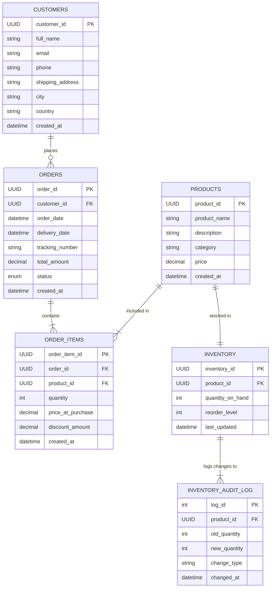

### 1. Entity-Relationship Diagram (ERD)

The following diagram illustrates the normalized (3NF) schema designed for this project. The system utilizes **UUIDs** for all primary keys to ensure scalability and security.

### 2. Design Choices & Constraints

#### Data Modeling & Normalization (3NF)

-   **1NF (Atomic Values):** All columns contain atomic values; no repeating groups.
    
-   **2NF (Partial Dependency):** The `Inventory` table was separated from `Products` (1:1 relationship) to separate static catalog data (Price, Description) from volatile operational data (Stock Levels), reducing locking contention during high-volume updates.
    
-   **3NF (Transitive Dependency):** Customer location details (City, Country) are stored strictly in the `Customers` table and referenced via Foreign Key, preventing data redundancy in `Orders`.
    

#### Key Design Decisions

-   **UUIDs vs Integers:** We replaced standard `SERIAL` integers with **UUIDs (v4)** for all Primary Keys. This improves security (preventing ID enumeration attacks) and allows for easier future database sharding or merging without ID collisions.
    
-   **Audit & Compliance:** A dedicated `INVENTORY_AUDIT_LOG` table was implemented to track every stock change. This is populated via a database **Trigger**, ensuring that changes made by _any_ application or user are permanently recorded.
    
-   **Reactive Automation:** An **Auto-Restock Trigger** was added to the `Inventory` table. If stock falls below the `reorder_level` during a transaction, the system automatically triggers a replenishment event, eliminating manual monitoring.
    

#### Constraints & Integrity

-   **Primary Keys:** `UUID DEFAULT gen_random_uuid()` ensures globally unique identifiers.
    
-   **Foreign Keys:** `ON DELETE CASCADE` is applied to `Order_Items` to ensure data consistency; if an Order is deleted, its constituent items are automatically removed.
    
-   **Business Logic Constraints:**
    
    -   `CHECK (price >= 0)`: Prevents negative pricing.
        
    -   `CHECK (quantity_on_hand >= 0)`: Prevents negative inventory.
        
    -   `TIMESTAMPTZ`: Used for all date fields to ensure accurate time-zone handling across distributed systems.